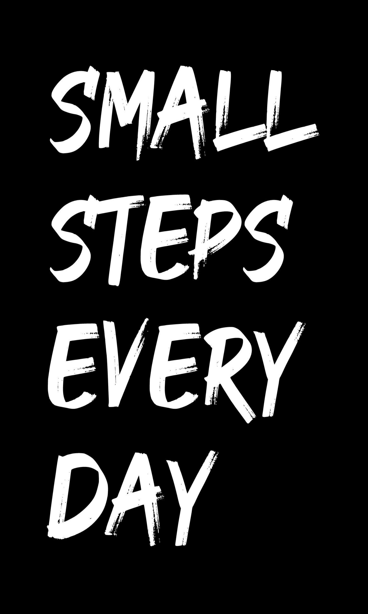

# Hi, welcome! 👋

I'm **Nazar Hrinchenko**, a CS student on my way to mastering data science. I'm in love with Python, R, C#, and even touch some C/C++ and assembly when needed (yeah, I like pain).

I run on **Linux Mint**, and I code in **VS Code**. No, I don't use Cursor. If you know, you know — that IDE writes code *for* you and kills your brain cells. Not worth the trade.

---

## ⚙️ Tech & Tools I Actually Use

---

## 📊 GitHub Stats

<table>
  <!-- LEFT 65 % ————>
  <tr>
    <td width="65%" valign="top">
      <!-- profile details -->
      
      <!-- two half-width cards in a 100 %-wide sub-table -->
      <table width="100%">
        <tr>
          <td width="50%">
            
          </td>
          <td width="50%">
            
          </td>
        </tr>
      </table>
      <!-- stats -->
      
    </td>
    <td width="35%" valign="top" align="center">
      
    </td>
  </tr>
</table>

---

## 🧠 Key points of programming

- I'm into understanding how stuff works, not just using it.
- I break things just to see how to fix them.

---
